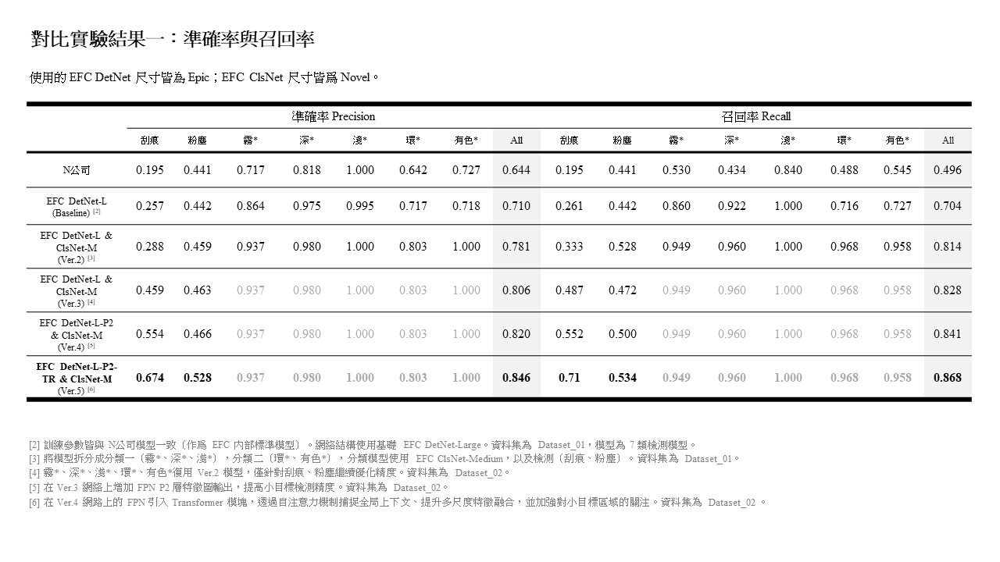
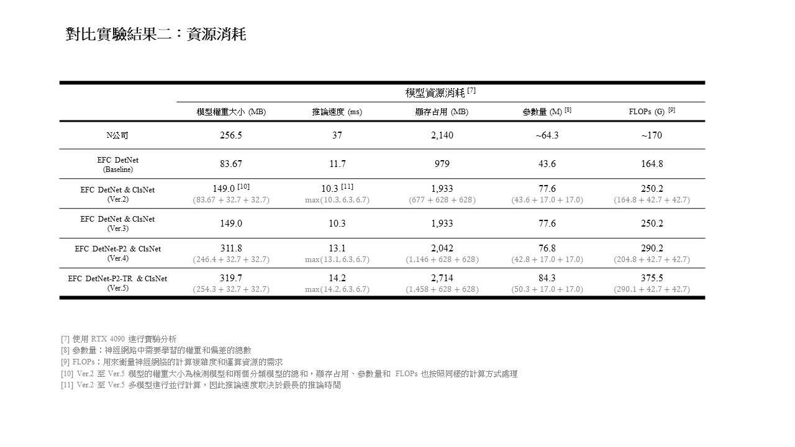
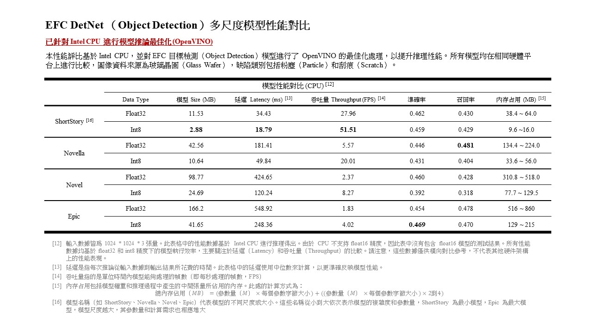
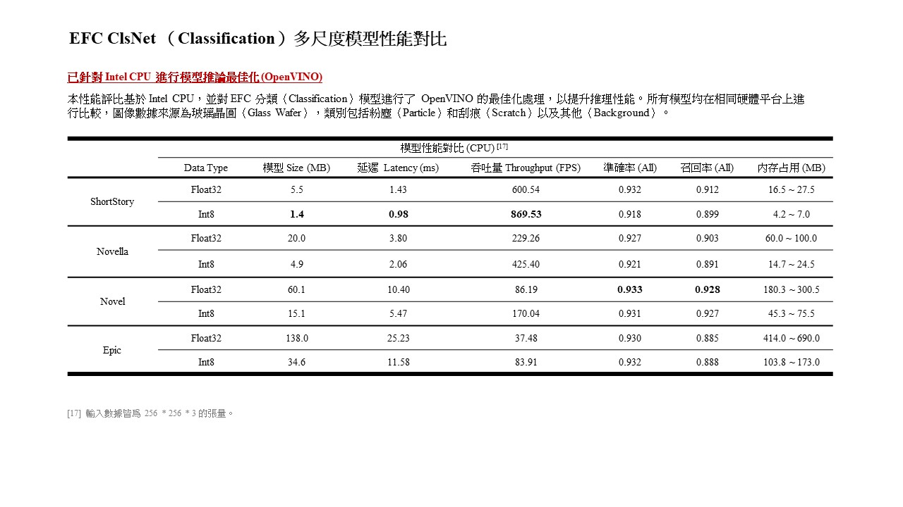

<!--
 * @Author: Will Cheng (will.cheng@efctw.com)
 * @Date: 2024-12-12 10:36:28
 * @LastEditors: Will Cheng (will.cheng@efctw.com)
 * @LastEditTime: 2024-12-12 10:45:55
 * @FilePath: /N_model_results/README.md
-->
# EFC Glass Wafer Defect Detection Model Evaluation

## 對比試驗 Comparative Experiment
- 準確率與召回率 Precision and Recall

- 資源消耗 Resource Consumption

## 多尺度模型模型性能對比 Multi-scale Model Performance Comparison
- 目標檢測模型 Object Detection Model

- 分類模型 Classification Model

